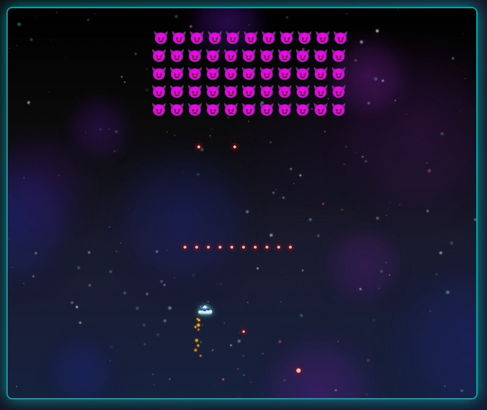

# Project #1 (Updated 2025 Edition)

Build a Game!
This project is about building a game in **HTML/CSS/JS**.
Originally built in 4 days (2 days in my case), then updated in 2025 for a fresh re‑immersion.

# The Game

## [Corona Invader](https://zyzto.github.io/Corona_Invader/) # click to play

This is a modern, emoji-powered take on Space Invaders with a thematic twist around the coronavirus. You’ll dodge waves of 🦠 invaders, pick up power-ups, and face off against the final boss — the Corona King 👹.

### Highlights
- Fast, arcade-style gameplay with smooth animations on HTML5 Canvas
- Level-based difficulty progression (6 total, including a boss fight)
- Powerups: Rapid Fire ⚡, Multi-Shot 🔥, Shield 🛡️, Slow Motion ⏱️
- Mobile-friendly controls (virtual joystick + shoot button)
- Optional debug tools (F1) for testing and quick level jumping

### Tech
- HTML5 Canvas for rendering
- Vanilla JavaScript for gameplay, animations, and state
- Responsive UI and accessibility touches

### Controls
- Desktop: A/D or ←/→ to move, W/S or ↑/↓ to adjust vertical position, Space or mouse click to shoot
- Mobile: Virtual joystick (left) to move, FIRE button (right) to shoot

Tip: Press F1 to open the debug panel locally, or append `?debug=true` to the URL.

## Levels

### Level 1 — Outbreak Begins
- Rows/Cols: 3x8
- Enemies: 🤢 only
- Pace: Introductory, slow bullets and movement

### Level 2 — Infection Spreads
- Rows/Cols: 4x9
- Enemies: 🤢 + 😷
- Pace: Moderate, mixed shot patterns

### Level 3 — Pandemic Mode
- Rows/Cols: 4x10
- Enemies: 🤢 + 😷 + 😈
- Pace: Faster bullets, denser formations

### Level 4 — Critical Condition
- Rows/Cols: 5x10
- Enemies: 😷 + 😈
- Pace: Aggressive, denser walls and spreads

### Level 5 — Final Defense
- Rows/Cols: 5x11
- Enemies: 😈 only
- Pace: High pressure, heavy patterns

### Level 6 — Boss: Corona King 👹
- Boss with phases 1–3, unique patterns and minions
- Health bar with adaptive behavior per phase

How to capture: during gameplay, use your OS screenshot tool. Store images under `docs/levels/*.png` and the links above will render automatically.

## Resources

- [Emoji reference](https://html-css-js.com/html/character-codes/)

- [Creating and Drawing on an HTML5 Canvas using JavaScript](https://codeburst.io/creating-and-drawing-on-an-html5-canvas-using-javascript-93da75f001c1)

- [MDN: Collision detection in Canvas](https://developer.mozilla.org/en-US/docs/Games/Tutorials/2D_Breakout_game_pure_JavaScript/Collision_detection)

- [MDN: 2D breakout game using pure JavaScript](https://developer.mozilla.org/en-US/docs/Games/Tutorials/2D_Breakout_game_pure_JavaScript)

- [Animations Generator (Animista)](https://animista.net)

- [CSS Gradient Text](https://cssgradient.io/blog/css-gradient-text/)

- [CSS Floating](https://codepen.io/MarioDesigns/pen/woJgeo)

- [Stack Overflow](https://stackoverflow.com/)
